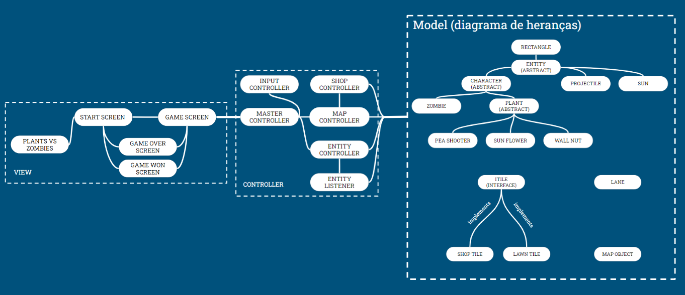

# Plants Vs Zombies

- O jogador deve utilizar diferentes plantas para defender o seu jardim de uma invasão de zumbis. 
- O jogo termina caso ao menos um zumbi atravesse o jardim (derrota) ou caso o jogador elimine todos os zumbis (vitória). 
- O jardim é constituído por um tabuleiro celular de 5 linhas e 8 colunas. Cada posição pode receber uma única planta.
- Cada planta possui um custo de pontos para ser posicionada no tabuleiro. O jogador adquire tais pontos coletando sóis produzidos pela planta girassol.

## João Pedro Carolino Morais - 198932

## Bruno Amaral Teixeira de Freitas - 246983

# Arquivo Executável do Jogo

> [Plants Vs Zombies Download](https://github.com/MC322EquipeBrunoJoao/TrabalhoFinalUhul/blob/main/src/pvz.jar)

# Slides do Projeto

## Slides da Prévia
[Link para slides da prévia](assets/slidesPrevia.pptx)
## Slides da Apresentação Final
[Link para slides da apresentação final](assets/slidesFinal(2).pptx)
## Relatório de Evolução

O primeiro desafio que enfrentamos foi definir como implementaríamos os gráficos do jogo, haja vista que não possuíamos familiaridade com interfaces gráficas e nem com o framework utilizado (LibGDX). A escolha do framework foi feita com base na sua facilidade de uso e potencial de criação, além da existência de uma ampla documentação que acelerou a curva de aprendizado. Um problema que resolvemos em termos da View foi o número excessivo de imagens que estavam sendo importadas conforme as entidades do jogo eram criadas. A solução que utilizamos foi o uso de atributos estáticos para texturas em classes cujas instâncias tem sempre a mesma aparência, de modo que as imagens agora são importadas apenas 1 vez para a classe, independentemente do número de objetos criados.

Outro grande desafio para o projeto foi a organização das entidades do jogo em um sistema de classes intuitivo e facilmente expandível. Abordamos essa questão buscando primeiro definir comportamentos gerais com classes abstratas, como na Entity - responsável por atribuir texturas a cada elemento do jogo, na sua herdeira Character - responsável por definir atributos e métodos comuns a todos os seres vivos do jogo, como os pontos de saúde e a ação de tomar dano - e na herdeira dessa última, Plant - que define comportamentos comuns às diferentes plantas do jogo. A partir desses modelos gerais, utilizamos heranças para criar classes de elementos específicos do jogo. Essa organização de classes está representada no componente Model do Diagrama Geral da Arquitetura do Jogo. 

Uma preocupação que tivemos foi em isolar a View, o Controller e Model. Para isso, organizamos o projeto de modo que o único ponto de acesso da View ao restante do código seja pela classe Master Controller, responsável por coordenar os demais controles do jogo. Um problema que tivemos ao programar o Model foi o fato de algumas classes possuirem comportamentos que devem ser informados ao Controller. Nossa primeira abordagem foi fazer essas classes se comunicarem diretamente com os controladores, porém concluímos que isso não seria uma boa prática, já que possibilitava que elas tivessem acesso a todo o controle do jogo. A solução que utilizamos foi a criação da classe Action Listener, que tem a função exclusiva de fazer essa comunicação entre componentes. Essas relações podem ser melhor visualizadas no Diagrama Geral da Arquitetura do Jogo.
# Diagramas

## Diagrama Geral da Arquitetura do Jogo (MVC)

### Componente Model:

**Ficha Técnica**
item | detalhamento
----- | -----
Pacote | `src/src/com/plantsvszombies/game/model`
Autores | `Bruno Freitas e João Morais`
Interfaces | `-`

### Componente View:

**Ficha Técnica**
item | detalhamento
----- | -----
Pacote | `src/src/com/plantsvszombies/game/view`
Autores | `Bruno Freitas e João Morais`
Interfaces | `-`

### Componente Controller:

**Ficha Técnica**
item | detalhamento
----- | -----
Pacote | `src/src/com/plantsvszombies/game/controller`
Autores | `Bruno Freitas e João Morais`
Interfaces | `-`

# Conclusões e trabalhos futuros

Concluímos que podemos fazer melhorias em termos de responsividade da interface gráfica, assim como aumentar a robustez de nossos componentes com o uso de interfaces providas e requeridas, escrever exceções para a importação de arquivos de mídia (texturas e efeitos sonoros) e expandir o número de plantas, projéteis e zumbis do jogo com base na estrutura de classes criada.

Uma possível melhoria que foi pensada porém não implementada por implicar em modificações significativas no código já escrito ao momento de sua idealização é a utilização do pattern Strategy com uma interface *DynamicEntity*, com método *move()*, que seria implementada por todos os elementos do jogo que apresentam movimentos. Dessa maneira, o Controller poderia iterar sobre um vetor declarado no tipo dessa interface e chamar o move para cada elemento a cada frame, tornando a movimentação das entidades do jogo bastante intuitiva.

Apesar dessas melhorias, acreditamos que o projeto final correspondeu de maneira muito satisfatória com o que esperávamos criar, além de ter sido uma ótima oportunidade para solidificar os conhecimentos aprendidos em sala.

Por fim, um possível trabalho futuro que foi sugerido durante nossa apresentação em sala é o estudo das consequências do isolamento entre componentes, como fizemos ao tornar o Master Controller a única ponte entre a View e o Controller, em termos de desempenho computacional.
