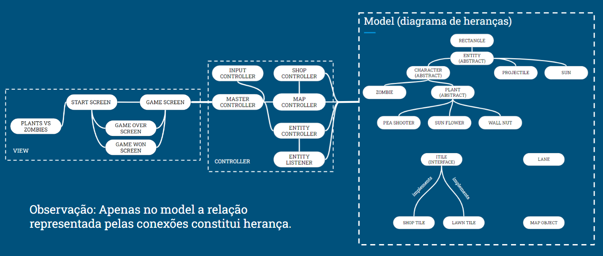

# Plants Vs Zombies

- O jogador deve utilizar diferentes plantas para defender o seu jardim de uma invasão de zumbis. 
- O jogo termina caso ao menos um zumbi atravesse o jardim (derrota) ou caso o jogador elimine todos os zumbis (vitória). 
- O jardim é constituído por um tabuleiro celular de 5 linhas e 8 colunas. Cada posição pode receber uma única planta.
- Cada planta possui um custo de pontos para ser posicionada no tabuleiro. O jogador adquire tais pontos coletando sóis produzidos pela planta girassol.

## João Pedro Carolino Morais - 198932

## Bruno Amaral Teixeira de Freitas - 246983

# Arquivo Executável do Jogo

> Coloque aqui um link para download do arquivo `jar` ou equivalente para execução do seu jogo.

# Slides do Projeto

## Slides da Prévia
[Link para slides da prévia](assets/slidesPrevia.pptx)
## Slides da Apresentação Final
[Link para slides da apresentação final](assets/slidesFinal.pptx)
# Diagramas

## Diagrama Geral da Arquitetura do Jogo

